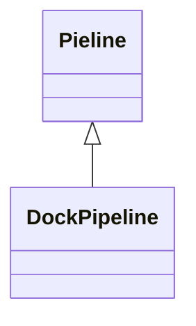

# Background
Execute the collection information pipline at the scheduled time. So need a service to schedule invoke pipeline.  
We create the BDS.Runtime service to invoke it.

# Requirements
+ Dynamic load and execute pipeline.

+ Control pipeline.

+ Store pipleine execution results.

## Detail Requirements

#### Dynamic load and execute pipeline
The type of collection infomation pipeline is divided into two parts. One types is dll file.
The dll file include detials steps of collection information.The dll file can be dynamic load and unload. This function is provided by .NET.

#### Control pipeline
We need to create, remove, update, stop pipeline and ensure correct execute at the right time according to the schedule time.

#### Store pipeline execution results.
Store execution results for analysis.

# Design
## Global design

# Feature

+ Load and Unload the reference pipeline assembly.
The Unload is a high risk feature base on the NetCore provide assembly [unloadability](https://docs.microsoft.com/en-us/dotnet/standard/assembly/unloadability) function. 
Think in Two ways:

  - Run GC.Collect everytime after unload assembly successfully that consume performance
  
  - The assembly was unloaded successfully but it can't be delete.  
  
As stated above, The BDS.Runtime not support dynamic unload assembly.
